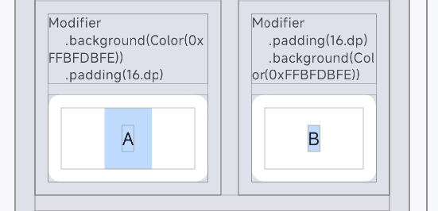

# 相关文档

- [Build better apps faster with Jetpack Compose](https://developer.android.com/compose)
- [android/compose-samples](https://github.com/android/compose-samples)
- [Compose 中的组件](https://developer.android.com/develop/ui/compose/components?hl=zh-cn)
- [Compose 中的布局](https://developer.android.com/develop/ui/compose/layouts?hl=zh-cn)

配套代码：

- [ComposeLearn](https://github.com/giagor/ComposeLearn)

# 整体介绍

**Compose UI 是对 Android UI 开发方式和 UI 运行机制的一次重构。**

1. **从命令式 UI 到声明式 UI** 
   传统 View 开发里，我们不仅要创建界面，还要在数据变化后手动更新界面，比如 `textView.setText("Hello")`。 
   Compose 更像是 `UI = f(State)`：界面由状态决定。状态变化后，Compose 会自动触发相关 UI 的重新执行，并尽量只更新受影响的部分。

2. **从继承式组件到组合式构建** 
   传统 View 体系强依赖继承，例如 `Button -> TextView -> View`，组件往往会带上很多并不总是需要的能力。 
   Compose 更强调“组合”：界面是由一个个小的可复用函数拼出来的。这样代码更灵活、更容易复用，也更容易按需组织 UI 能力。

3. **从 View 树驱动到 Compose 运行时驱动** 
   Compose 的界面节点不再是传统的 View 对象树，而是由 Compose Runtime 和 UI 系统管理。 
   它仍然有自己的**组合、布局、绘制**流程，但这套机制比传统 View 树更轻量，也更适合声明式更新。再配合编译器和运行时优化，Compose 可以更高效地完成界面更新与渲染。

# 学习路线

1. **基础入门**
   - 常用组件
   - Row / Column / Box
   - 列表、滚动、Material3 基础
   - Modifier 常见用法
3. **核心心智**
   - 声明式 UI 与重组
   - 渲染三阶段：组合 / 布局 / 绘制
   - 重组作用域
   - Modifier 执行顺序与包裹模型
4. **状态管理基础**
   - `mutableStateOf`
   - `remember`
   - `rememberSaveable`
   - 状态提升
   - 单向数据流
5. **副作用与异步**
   - `LaunchedEffect`
   - `DisposableEffect`
   - `snapshotFlow`
   - `SideEffect`
   - `produceState`
6. **性能与进阶状态**
   - `derivedStateOf`
   - 为什么会发生不必要重组
   - Stability
   - 列表延迟加载、避免无效计算
7. **互操作与工程化**
   - Compose 和 View 混编
   - ViewModel 配合、导航、主题、分层架构
8. **自定义能力**
   - 自定义 Layout
   - 自定义绘制
   - `graphicsLayer`

# 基础入门

## 组件和布局

- Compose 是声明式 UI：`UI = f(State)`
- `@Composable` 函数用来声明界面，不是手动操作界面
- 页面通常由很多小 Composable 组合而成


本阶段接触过的组件：

- `Text`：显示文本
- `Button` / `OutlinedButton`：触发操作
- `Card`：承载内容
- `TextField` / `OutlinedTextField`：输入内容
- `Checkbox` / `Switch` / `Slider`：表达和修改状态
- `LinearProgressIndicator`：展示进度
- `AssistChip` / `FilterChip`：展示轻量操作或筛选项


最重要的 4 个布局：

- `Column`：纵向排列
- `Row`：横向排列
- `Box`：叠层布局
- `Spacer`：制造间距

传统布局和 Compose 布局的映射关系：

- `LinearLayout` -> `Row` / `Column`
- `FrameLayout` -> `Box`
- `ScrollView` -> `Column + verticalScroll(...)`
- `HorizontalScrollView` -> `Row + horizontalScroll(...)`
- `RecyclerView` -> `LazyColumn` / `LazyRow`
- `RelativeLayout` -> 没有完全等价的默认容器，通常用 `Row` / `Column` / `Box` 组合替代
- `ConstraintLayout` -> Compose 里也有官方库 `constraintlayout-compose`，但不是默认首选，通常在复杂约束场景下按需使用

对应代码：

- [BasicLayoutsSection](https://github.com/giagor/ComposeLearn/blob/main/app/src/main/java/com/example/composelearn/BasicsLearningScreen.kt#L303)


滚动相关：

- `Column` 默认不滚动
- `Row` 默认不滚动
- 需要滚动时，显式加 `verticalScroll(...)` 或 `horizontalScroll(...)`

常见选择：

- `Column`：内容少，不滚动
- `Column + verticalScroll`：内容少，但要整体滚动
- `LazyColumn`：长列表、数据列表

对应代码：

- [ScrollSection](https://github.com/giagor/ComposeLearn/blob/main/app/src/main/java/com/example/composelearn/BasicsLearningScreen.kt#L392)
- [LazyColumnSection](https://github.com/giagor/ComposeLearn/blob/main/app/src/main/java/com/example/composelearn/BasicsLearningScreen.kt#L495)


容器相关：

- `Surface`：更基础、更通用的容器
- `Card`：更场景化、更语义化的容器


简单记：

- 想包一层背景、圆角、承载面：`Surface`
- 想表达“这是一张卡片”：`Card`

## Modifier

`Modifier` 用来控制：

- 尺寸：`fillMaxWidth()`、`height()`、`size()`
- 间距：`padding()`
- 外观：`background()`、`clip()`、`border()`
- 布局行为：`weight()`、`align()`
- 滚动：`verticalScroll()`、`horizontalScroll()`

最重要的一点：

- `Modifier` 是按顺序执行的
- 顺序不同，效果可能不同

## 状态

本阶段接触到的核心写法：

```kotlin
var name by remember { mutableStateOf("Compose") }
```

理解这句就够了：

- `mutableStateOf(...)` 创建状态
- `remember { ... }` 让状态在重组时保留
- 状态变化会驱动 UI 更新

常见模式：

```kotlin
TextField(
    value = name,
    onValueChange = { name = it }
)
```

也就是：

- 组件接收当前值
- 用户修改时通过回调抛出新值
- 你更新状态
- UI 自动刷新

# 核心心智

## 声明式 UI 与重组

核心结论：

- Compose 更像 `UI = f(State)`
- 状态变了，Compose 会重新执行相关 Composable
- 重组不等于整页重建，谁读取状态，谁就更相关


声明式 UI：

```kotlin
var count by remember { mutableIntStateOf(0) }

Text(
    text = if (count == 0) "还没有点击" else "已经点击了 $count 次"
)

Button(onClick = { count++ }) {
    Text("点击 +1")
}
```

 - 改的是状态，不是手动改控件
 - UI 会自动反映当前状态


重组：

```kotlin
@Composable
fun Screen() {
    var count by remember { mutableIntStateOf(0) }

    Column {
        CounterText(count)
        StaticTitle()
    }
}

@Composable
fun CounterText(count: Int) {
    Text("count = $count")
}

@Composable
fun StaticTitle() {
    Text("我是固定标题")
}
```

- `count` 变化后，`CounterText(count)` 更相关
- `StaticTitle()` 不读取 `count`，通常就没那么相关
- 谁读取状态，谁就更可能跟着重组

## 组合 / 布局 / 绘制

组合：决定有哪些 UI

布局：决定多大、放哪

绘制：决定长什么样

组合：

```kotlin
if (showText) {
    Text("我是可选内容")
}
```

`showText` 改变后，这块 UI 会出现或消失，这是组合层面的变化。


布局：

```kotlin
Box(
    modifier = Modifier.size(if (expanded) 120.dp else 60.dp)
)
```

UI 还在，但大小变了，这是布局层面的变化。


绘制：

```kotlin
Box(
    modifier = Modifier.background(
        if (highlight) Color.Yellow else Color.Gray
    )
)
```

UI 还在，大小和位置也没变，主要变化是颜色或背景，这是绘制层面的变化。

## 重组和三阶段的关系

> 三阶段：组合 / 布局 / 绘制

这一节要说明的是：重组和三阶段不是一回事。

- 重组回答的是：哪些 Composable 要重新执行

- 三阶段回答的是：重新执行后，UI 哪一层真的发生了变化

- 状态变了，先发生重组，重组会重新执行相关 Composable，接着 Compose 再决定这次变化主要影响组合、布局还是绘制

  

重组与组合：

```kotlin
if (showText) {
    Text("Hello")
}
```

`showText` 变了 -> 相关 Composable 重组 -> 这块 UI 直接出现 / 消失 -> 更接近影响组合。


重组与布局：

```kotlin
Box(
    modifier = Modifier.size(if (expanded) 120.dp else 60.dp)
)
```

`expanded` 变了 -> 相关 Composable 重组 -> UI 还在，但尺寸变了 -> 更接近影响布局。


重组与绘制：

```kotlin
Box(
    modifier = Modifier.background(
        if (highlight) Color.Yellow else Color.Gray
    )
)
```

`highlight` 变了 -> 相关 Composable 重组 -> UI 还在，大小位置没变，主要是颜色变了 -> 更接近影响绘制。

## 重组作用域

核心结论：

- Compose 里有"重组作用域"这个概念
- 状态变化时，不一定整个 Composable 都重组
- Compose 会尽量只重组读取该状态的那块作用域。状态在哪个作用域里被读取，哪个作用域就更可能重组
- `SideEffect` 是否执行，也取决于它所在作用域是否真的重组


它是什么：

- 这里的"作用域"不是 Kotlin 变量作用域
- 这里说的是 Compose 用来决定"哪一块需要重新执行"的边界


为什么需要它：

- 如果没有这个机制，一个状态变化可能让整页都重新执行
- Compose 想做的是：只更新真正受影响的部分


直觉例子：

```kotlin
@Composable
fun Screen() {
    var count by remember { mutableIntStateOf(0) }

    Column {
        Text("标题")
        Button(onClick = { count++ }) {
            Text("count = $count")
        }
    }
}
```

- `count` 只在按钮里的 `Text` 被读取
- `count` 变化时，Compose 更倾向于只重组和这块读取相关的范围

## Modifier 执行顺序 / 包裹模型

核心结论：

- Modifier 是链式执行的
- 顺序不同，包裹关系不同，结果也可能不同


未加 Modifier 的原始效果：

```kotlin
Text(
    text = "A"
)

Text(
    text = "B"
)
```


加了 Modifier 后的效果对比：

```kotlin
Text(
    text = "A",
    modifier = Modifier
        .background(Color(0xFFBFDBFE))
        .padding(16.dp)
)

Text(
    text = "B",
    modifier = Modifier
        .padding(16.dp)
        .background(Color(0xFFBFDBFE))
)
```



# 状态管理基础

## mutableStateOf / remember

核心写法：

```kotlin
var name by remember { mutableStateOf("Compose") }
```

各自负责：

- `mutableStateOf(...)` 创建可观察状态
- `remember { ... }` 让状态在重组时保留
- 状态变化会驱动 UI 更新


加了 `remember`：

```kotlin
@Composable
fun Counter(trigger: Int) {
    var count by remember { mutableIntStateOf(0) }

    Text("count = $count, trigger = $trigger")
}
```

+ `trigger` 变化时，`Counter(trigger)` 也会重组；但因为 `count` 被 `remember` 保住了，所以这份状态对象不会重新创建。

+ 加了 `remember`：下次重组时，继续使用同一个状态对象


不加 `remember`：

```kotlin
@Composable
fun Counter(trigger: Int) {
    var count by mutableIntStateOf(0)

    Text("count = $count, trigger = $trigger")
}
```

+ `trigger` 变化时，`Counter(trigger)` 会重组；这时 `var count by mutableIntStateOf(0)` 会重新执行，状态对象可能重新创建，`count` 就可能回到初始值。

- 不加 `remember`：如果 Composable 因为重组重新执行到这行代码，就会重新创建一份新的 `mutableIntStateOf(0)`


`remember` 加 key：

```kotlin
val result = remember(keyword) { createSomething(keyword) }
```

- 作用：key 不变时复用上次对象，key 变化时重新创建
- 什么时候传：当你希望 remembered 对象在某些输入变化时整体重建
- 这里的 key 不是“参与计算”本身，而是“决定要不要重建这份 remembered 对象”
- **Key 可以是普通的数据类型，也可以是 `compose state`。`remember(key)` 不是靠"订阅这个 key 的变化"工作的，而是靠"这次 Composable 又执行到这里时，顺手比较一下新旧 key"，从而决定是否重建**。

## rememberSaveable

核心写法：

```kotlin
var count by remember { mutableIntStateOf(0) }
var count by rememberSaveable { mutableIntStateOf(0) }
```

各自负责：

- `remember` 让状态在重组时保留
- `rememberSaveable` 在此基础上，进一步处理配置变化后的恢复，例如旋转屏幕后，`rememberSaveable` 的数据通常还能恢复。它更适合输入框内容、当前 tab、简单筛选条件这类需要恢复的 UI 状态。

## 状态提升

核心结论：

- 状态不要总写在组件内部
- 很多时候应该把状态提到外层统一管理


对比：

```kotlin
// 组件内部管理状态
@Composable
fun StatefulCounter() {
    var count by remember { mutableIntStateOf(0) }

    CounterCard(
        label = "内部状态",
        count = count,
        onIncrement = { count++ },
        onReset = { count = 0 }
    )
}
```

```kotlin
// 外部管理状态
@Composable
fun StatelessCounter(
    count: Int,
    onIncrement: () -> Unit,
    onReset: () -> Unit
) {
    CounterCard(
        label = "外部状态",
        count = count,
        onIncrement = onIncrement,
        onReset = onReset
    )
}
```

- 组件内部自己管状态时，组件更完整，但复用和测试会更受限
- 外层统一管理状态时，子组件只负责展示和回调，职责更清晰
- 这就是状态提升：把状态提到更高一层

## 单向数据流

核心结论：

- 状态从父组件传给子组件
- 事件由子组件通过回调抛给父组件
- 单向数据流通常建立在状态提升的基础上


最小例子：

```kotlin
@Composable
fun SearchPage() {
    var query by remember { mutableStateOf("") }
    var submitCount by remember { mutableIntStateOf(0) }

    SearchBox(
        query = query,
        onQueryChange = { query = it },
        onSubmit = { submitCount++ }
    )
}
```

```kotlin
@Composable
fun SearchBox(
    query: String,
    onQueryChange: (String) -> Unit,
    onSubmit: () -> Unit
) {
    TextField(value = query, onValueChange = onQueryChange)
    Button(onClick = onSubmit) { Text("提交") }
}
```

数据流方向：

- 状态下行：`query` 从父组件传给 `SearchBox`
- 事件上行：`onQueryChange` / `onSubmit` 从 `SearchBox` 回到父组件

几个好处：

- 状态来源更清晰
- 组件职责更单一
- 排查问题和后续扩展更容易

# 副作用与异步

## LaunchedEffect

核心结论：

- `LaunchedEffect` 是 Compose 提供的副作用 API
- 它适合启动和当前 UI 生命周期绑定的协程
- `LaunchedEffect` 内部的协程会在进入组合后自动启动，离开组合后自动取消


副作用：

- 副作用指的不是单纯描述 UI 的代码
- 启动协程、发请求、倒计时、订阅这类额外动作，都属于副作用


什么时候使用：

- 页面进入后自动加载一次数据
- 页面出现后开始倒计时
- 某个 key 变化后自动发起异步任务


`LaunchedEffect`使用例子：

```kotlin
LaunchedEffect(Unit) {
    while (true) {
        delay(1000)
        seconds++
    }
}
```

- `LaunchedEffect(Unit)` 常用于页面进入后的首次加载、倒计时、自动刷新

```kotlin
LaunchedEffect(keyword) {
    searchResult = "搜索中..."
    delay(700)
    searchResult = "\"$keyword\" 的结果已返回"
}
```

- `LaunchedEffect(keyword)` 常用于搜索、防抖、根据条件变化自动刷新
- `keyword` 变化时，旧协程会取消，再按新的 `keyword` 启动新协程


`LaunchedEffect` 和组合的关系 例子：

```kotlin
@Composable
fun Outer(showDemo: Boolean, showEffect: Boolean) {
    if (showDemo) {
        Demo(showEffect)
    }
}

@Composable
fun Demo(showEffect: Boolean) {
    if (showEffect) {
        LaunchedEffect(Unit) {
        }
    }
}
```

- 情况 1：`showDemo` 一直是 `true`，`showEffect` 从 `false -> true`，这次组合结果里第一次出现这个 `LaunchedEffect`，它内部的协程会启动
- 情况 2：`showDemo` 一直是 `true`，`showEffect` 从 `true -> false`，这次组合结果里这个 `LaunchedEffect` 消失，旧协程会取消
- 情况 3：一开始 `showDemo = true`，`showEffect = true`，协程已经启动；后来 `showDemo = false`，`Demo()` 整块离开组合，里面的 `LaunchedEffect` 也会一起消失，旧协程会取消


`LaunchedEffect` 和组合的关系 结论：

- `LaunchedEffect` 是否启动和取消，取决于它对应的调用点还在不在当前组合结构里
- `LaunchedEffect` 进入组合：它内部的协程启动
- `LaunchedEffect` 离开组合：它内部的协程取消
- `LaunchedEffect` 的 key 变化：取消旧协程，按新的 key 重启

## DisposableEffect

核心结论：

- `DisposableEffect` 适合注册资源，并在离开组合或 key 变化时清理资源
- 它不负责启动协程，重点是 `onDispose`


什么时候使用：

- 注册监听器
- 绑定回调
- 添加观察者
- 接入需要手动释放的对象


最小例子：

```kotlin
DisposableEffect(listenerId) {
    registerListener(listenerId)

    onDispose {
        unregisterListener(listenerId)
    }
}
```

- 进入组合：执行注册逻辑
- key 变化：先清理旧资源，再按新 key 重新注册
- 离开组合：执行 `onDispose`


典型场景：

```kotlin
// 注册监听器
DisposableEffect(locationManager) {
    val listener = LocationListener { location ->
    }

    locationManager.register(listener)

    onDispose {
        locationManager.unregister(listener)
    }
}
```

```kotlin
// 绑定回调
DisposableEffect(player) {
    val callback = object : PlayerCallback {
        override fun onPlay() {
        }
    }

    player.setCallback(callback)

    onDispose {
        player.clearCallback()
    }
}
```

```kotlin
// 添加观察者
DisposableEffect(lifecycleOwner) {
    val observer = LifecycleEventObserver { _, event ->
    }

    lifecycleOwner.lifecycle.addObserver(observer)

    onDispose {
        lifecycleOwner.lifecycle.removeObserver(observer)
    }
}
```

```kotlin
// 接入需要手动释放的对象
DisposableEffect(cameraController) {
    cameraController.startPreview()

    onDispose {
        cameraController.stopPreview()
        cameraController.release()
    }
}
```

## snapshotFlow

核心结论：

- `snapshotFlow` 可以把 Compose 状态变化转成 Flow
- 它主要用于观察 Compose state，不是普通变量


什么时候使用：

- 输入框内容变化后做搜索或防抖
- 滚动位置变化后做上报或联动（把滚动状态当成一个持续变化的数据源，拿来做统计，或者驱动别的界面状态变化）
- 选择状态变化后继续走 Flow 处理链


最小例子：

```kotlin
LaunchedEffect(Unit) {
    snapshotFlow { keyword }
        .filter { it.isNotBlank() }
        .distinctUntilChanged()
        .collectLatest { value ->
            latestLog = "\"$value\" 触发了一次收集"
        }
}
```

- `snapshotFlow { keyword }`：观察 `keyword` 这个 Compose 状态
- `filter { it.isNotBlank() }`：过滤空字符串
- `distinctUntilChanged()`：相同值不重复往下传
- `collectLatest { value -> ... }`：如果前一个值的处理还没结束，新值来了就取消前一个，优先处理最新值


和 Compose 状态的关系：

- `snapshotFlow` 观察的是 block 里读取到的 Compose 状态
- 如果只是普通 `String` 或普通变量，它不会像 Compose state 那样被持续观察


作用：

- 把 Compose 状态接入 Flow 的处理链
- 让状态变化可以继续配合 `filter`、`distinctUntilChanged`、`collectLatest` 这类操作符使用

## SideEffect

> 参考：Stack Overflow: [Android Compose side effects: Side-Effect behavior](https://stackoverflow.com/questions/78071347/android-compose-side-effects-side-effect-behavior)

核心结论：

- `SideEffect` 适合在每次成功重组后，把最新状态同步给外部对象
- 它不是协程 API，也不是资源清理 API
- 它是否执行，取决于它所在的重组作用域是否真的发生了重组


什么时候使用：

- 同步 analytics / 埋点 SDK 的当前状态
- 把最新 Compose 状态同步给旧 View 或外部 holder
- 做轻量的外部状态桥接


最小例子：

```kotlin
SideEffect {
    analytics.setCurrentScreen(screenName)
}
```

- 每次成功重组后，把最新 `screenName` 同步给外部对象


`Counter2` 例子：

```kotlin
@Composable
fun Counter2() {
    var counter by remember { mutableStateOf(0) }

    SideEffect {
        Log.d("Test tag", "Counter2: $counter")
    }

    Column {
        Button(onClick = { counter++ }) {
            Text("Increase count is: $counter")
        }
    }
}
```

点击按钮后，`SideEffect` 可能不会继续执行。原因：

- `counter` 的读取发生在 `Button` 里的 `Text` 那层
- `Button` 的内容 lambda 会形成更内层作用域
- 点击按钮后，更内层作用域重组时，外层放着 `SideEffect` 的作用域可能被跳过
- `SideEffect` 不在那层真正重组的作用域里，所以可能不会执行


`Counter1` 例子：

```kotlin
@Composable
fun Counter1() {
    var counter by remember { mutableStateOf(0) }

    SideEffect {
        Log.d("Test tag", "Counter1: $counter")
    }

    Column {
        Button(onClick = { counter++ }) {
            Text("Increase count")
        }
        Text("Counter value is: $counter")
    }
}
```

`Counter1`：点击按钮后，`SideEffect` 会继续执行。原因：

- `counter` 被外面的 `Text("Counter value is: $counter")` 读取
- **那么不是 `Column` 也形成了作用域吗？`Column` 是 `inline` 的，这里的内容会直接使用外围作用域。因为`SideEffect`所在的那个重组作用域真的发生了重组，因此`SideEffect`内部代码会执行**。

## produceState

核心结论：

- `produceState` 可以把一段异步生产过程直接包装成 Compose 可读取的 `State`
- 它适合"我要一个给 UI 直接读取的结果"这种场景


什么时候使用：

- 根据某个 key 异步加载一个结果给 UI
- 想把“异步过程 -> UI 状态”收在一起
- 想直接得到一个可读的 `State`


最小例子：

```kotlin
val result by produceState(
    initialValue = "等待加载...",
    key1 = keyword
) {
    value = "加载中..."
    delay(700)
    value = "\"$keyword\" 的异步结果"
}
```

- `initialValue`：初始值
- `key1 = keyword`：`keyword` 变化后，内部生产逻辑会按新的 key 重新开始
- `value = ...`：在 block 里直接更新要暴露给 UI 的状态


和 `LaunchedEffect` 的区别：

- `LaunchedEffect`：重点是执行一段协程逻辑
- `produceState`：重点是得到一个给 UI 直接读取的状态结果

```kotlin
var result by remember { mutableStateOf("等待加载...") }

LaunchedEffect(keyword) {
    result = "加载中..."
    delay(700)
    result = "\"$keyword\" 的结果"
}
```

```kotlin
val result by produceState(
    initialValue = "等待加载...",
    key1 = keyword
) {
    value = "加载中..."
    delay(700)
    value = "\"$keyword\" 的结果"
}
```

- 想执行协程逻辑，用 `LaunchedEffect`
- 想把异步逻辑直接包装成 UI 状态，用 `produceState`

## 小结

| API | 核心作用 | 什么时候用 |
| --- | --- | --- |
| `LaunchedEffect` | 启动和当前 UI 生命周期绑定的协程 | 页面进入后加载、倒计时、key 变化后的异步任务 |
| `DisposableEffect` | 注册资源，并在离开组合或 key 变化时清理 | 监听器、回调、观察者、需要手动释放的对象 |
| `snapshotFlow` | 把 Compose 状态变化转成 Flow | 搜索、防抖、滚动状态监听、状态流处理 |
| `SideEffect` | 每次成功重组后，把最新状态同步给外部对象 | analytics、旧 View 桥接、外部 holder 同步 |
| `produceState` | 把异步生产过程直接包装成 `State` | 根据 key 异步加载结果给 UI、收口异步状态 |

# 性能与进阶状态

## derivedStateOf

核心结论：

- `derivedStateOf` 用来表达派生状态
- 派生状态 = 完全由其他状态推导出来的状态
- 它首先是状态建模更清楚，在某些场景下也可能带来性能收益


什么时候使用：

- 一个状态完全由其他状态推导出来
- 这个派生结果会被多处读取
- 你想把依赖关系单独表达清楚


最小例子：

```kotlin
val canSearch by remember {
    derivedStateOf { keyword.trim().length >= 3 }
}
```

- `canSearch` 不是独立状态，它完全由 `keyword` 推导出来
- 需要被 `remember` 的不是布尔值本身，而是 `derivedStateOf` 创建出来的派生状态对象
- 如果不加 `remember`，每次重组都会重新创建一个新的派生状态对象。虽然很多简单场景下看起来也能跑，但这样就失去了重点：这不是一份稳定复用的派生状态，而是每次重组都重新构造一次


什么时候没必要用：

```kotlin
Text(if (score >= 60) "及格" else "不及格")
```

- 如果只是一次性、很短的判断，不一定要上 `derivedStateOf`


可能的性能收益：

```kotlin
var score by remember { mutableFloatStateOf(60f) }
val isPassed by remember {
    derivedStateOf { score >= 60f }
}

DirectThresholdPanel(score = score)
DerivedThresholdPanel(isPassed = isPassed)
```

```kotlin
@Composable
fun DirectThresholdPanel(score: Float) {
    val isPassed = score >= 60f

    Log.d(TAG, "DirectThresholdPanel1 start")
    SideEffect {
        Log.d("AdvancedState", "DirectThresholdPanel1 recomposed, score=$score, isPassed=$isPassed")
    }

    Text("score = $score, isPassed = $isPassed")
}
```

```kotlin
@Composable
fun DerivedThresholdPanel(isPassed: Boolean) {
    Log.d(TAG, "DerivedThresholdPanel2 start")
    SideEffect {
        Log.d("AdvancedState", "DerivedThresholdPanel2 recomposed, isPassed=$isPassed")
    }

    Text("isPassed = $isPassed")
}
```

- 拖动 `60..100` 之间的滑块时，`score` 会频繁变化，但 `isPassed` 会一直是 `true`。Logcat 里，`DirectThresholdPanel1 start`和`DirectThresholdPanel1 recomposed...` 会更频繁出现；`DerivedThresholdPanel2 start`和`DerivedThresholdPanel2 recomposed...` 会明显更少，甚至在 `isPassed` 一直没变时不再继续打印
- 不用 `derivedStateOf` 时，下游直接依赖 `score`，`score` 每次变化都更容易触发下游继续参与重组
- 用了 `derivedStateOf` 后，下游只依赖 `isPassed`；当结果一直是 `true` 时，那部分更容易被跳过
- 这就是它可能带来的性能收益：当底层状态频繁变化、派生结果没变时，能减少下游对高频原始状态的无意义响应


`derivedStateOf`与`remember` 一起用时（`keyword`是`compose state`）：

```kotlin
var keyword by remember { mutableStateOf("") }
val filteredLessons by remember {
    derivedStateOf {
        allLessons.filter { it.contains(keyword, ignoreCase = true) }
    }
}
```

- 这里通常不一定要写 `remember(keyword)`，**因为 `derivedStateOf` 会追踪它在 `block` 里读取到的 `Compose state`**，比如这里的 `keyword`
- `remember(keyword)` 更像是“keyword 一变，连派生状态对象也一起重建”
- **注意：如果`allLessons`是普通的`List`，那么它的引用变化或者内部元素数量发生变化，derivedStateOf不会重计算。当`allLessons`是`compose state`，例如`mutableStateListOf`时，它的引用发生变化，或者内部元素数量发生变化，此时会引起derivedStateOf的重计算**。


一句话区分：

- 想表达“这是一个派生状态”，用 `derivedStateOf`
- 只是临时写一行简单判断，不一定需要它

## 为什么会发生不必要重组

核心结论：

- 重组本身不是坏事
- 真正要关注的是：某块 UI 是否因为"读了太多状态"或"接了太多变化参数"而被频繁卷进去
- 很多"不必要重组"的根源，是把高频原始状态直接传给了只需要低频结果的子组件


什么时候容易发生：

- 子组件只需要一个判断结果，但父组件把整个原始状态都传下去了
- 某个状态变化很频繁，但下游其实只关心一个更粗粒度的结果
- 状态读取位置太高，导致一大段 UI 都跟这个状态建立了依赖


最小例子：

```kotlin
var keyword by remember { mutableStateOf("") }
val canSubmit by remember {
    derivedStateOf { keyword.trim().length >= 3 }
}

RawKeywordPanel(keyword = keyword)
SubmitButtonHintPanel(canSubmit = canSubmit)
```

```kotlin
@Composable
fun RawKeywordPanel(keyword: String) {
    Text("keyword.length = ${keyword.length}")
}
```

```kotlin
@Composable
fun SubmitButtonHintPanel(canSubmit: Boolean) {
    Text(if (canSubmit) "按钮可以提交" else "按钮暂时不能提交")
}
```

- `RawKeywordPanel` 直接依赖 `keyword`，所以每次输入变化都更容易继续参与重组
- `SubmitButtonHintPanel` 只依赖 `canSubmit`，当 `keyword` 从 `"abc"` 变成 `"abcd"` 时，`canSubmit` 还是 `true`，这部分就更容易被跳过


怎么判断是不是该优化：

- 先问子组件"真正需要什么"
- 如果它只需要一个派生结果，就只传这个结果
- 如果它需要的是高频原始值，那它跟着更新通常就是合理的，不算多余


一句话记忆：

- 不必要重组，常常不是因为"重组发生了"
- 而是因为"本来只需要结果，却把整个变化过程都传下去了"

## Stability

> 官方文档：[Stability in Compose](https://developer.android.com/develop/ui/compose/performance/stability)
>

核心结论：

- `Stability` 影响的重点，不是"父层会不会重组"
- 它更影响的是：父层重组后，子调用能不能更放心地被 `skip`
- 参数越稳定，Compose 越敢跳过
- 参数越不稳定，Compose 越保守


先记一个流程：

- 状态变化
- 父作用域可能进入重组
- Compose 走到子 Composable 调用点
- 判断这次能不能 `skip`
- 能跳过就不执行子函数体，不能跳过才继续执行


什么叫 immutable：

- 更偏向"对象本身不会变"，它是一种较强的约束
- 数据变化时，通常是创建新对象，而不是改旧对象
- 例子：`data class xxx(val xx: String)` 接近 immutable，`data class xx(val xx: MutableList<String>)` 不是典型的 immutable，因为里面内容还是可能被改


什么叫 stable：

- 不是"永远不会变"，更像是"如果它变了，Compose 能可靠地知道；如果它没变，Compose 可以更放心地跳过"
- 例子：`mutableStateOf(0)` 值会变，但变化对 Compose 可追踪，所以它可以是 stable


两者区别：

- `immutable` 关注的是对象内容是否变化
- `stable` 关注的是这类对象对 Compose 来说是不是可预测。有些东西会变，但依然可以对 Compose 友好，比如 `State<T>`


什么时候会更保守：

- Compose 最怕"误跳过"，如果一个子调用本来该更新，却被错误 `skip`，UI 就可能不对，所以当 Compose 不够放心时，会选择继续执行，而不是冒险跳过
- 直接表现就是：更少 `skip`，更容易继续执行子调用


常见更友好的参数：

- `Int`
- `String`
- `Boolean`
- 简单的 `data class(val ...)`


常见要小心的参数：

- 带 `var` 的普通对象
- 可变对象
- `List`
- Compose 不容易确认语义的复杂类型


为什么 `List` 要小心：

- `List` 是容器，不只是一个简单值。比如 列表里面的元素稳不稳定、列表背后是不是可变集合。它通常会比基础类型更容易让 Compose 保守

## 列表与性能

### LazyColumn 延迟加载

核心结论：

- `LazyColumn` 不会一上来把所有 item 都组合出来
- 它会优先处理当前可见区域附近的内容
- 继续滚动时，新的 item 才会陆续进入组合


最小例子：

```kotlin
LazyColumn {
    items(lessons) { lesson ->
        LessonRow(lesson)
    }
}
```

- 这里的 `items(...)` 是批量声明列表项
- 首次进入页面时，通常不会一次把整份列表都组合完
- 这就是 `LazyColumn` 的核心价值：按需组合


### key 的作用

核心结论：

- `key` 用来告诉 Compose“这一项是谁”，让  item 内部状态会不会错位
- 列表发生插入、删除、移动时，Compose 更容易把新旧 item 对上


最小例子：

```kotlin
LazyColumn {
    items(
        items = messages,
        key = { it.id }
    ) { message ->
        MessageRow(message)
    }
}
```

- `items = messages`：数据源
- `key = { it.id }`：每一项的稳定标识
- 最后这个 lambda：每一项长什么样


什么时候需要写 key：

- 列表项有稳定 id
- 列表会插入、删除、移动、排序
- item 内部有 `remember` 状态、输入框状态、展开收起状态


### 避免无效计算

核心结论：

- 列表性能问题，不只是“有没有重组”
- 更常见的是：一重组，就顺手把过滤、排序、映射这类计算白算一遍
- 列表越大、计算越重，这类无效计算越值得避免


对比：

```kotlin
@Composable
private fun AvoidWastefulCalculationLesson() {
    var keyword by remember { mutableStateOf("") }
    var unrelatedTick by remember { mutableIntStateOf(0) }

    val allLessons = remember {
        List(50) { index -> "Compose Topic ${index + 1}" }
    }

    val filteredLessons by remember(keyword) {
        derivedStateOf {
            allLessons.filter { it.contains(keyword, ignoreCase = true) }
        }
    }

    DirectFilterPanel(
        keyword = keyword,
        unrelatedTick = unrelatedTick,
        allLessons = allLessons
    )

    DerivedFilterPanel(
        keyword = keyword,
        unrelatedTick = unrelatedTick,
        filteredLessons = filteredLessons
    )
}
```

```kotlin
@Composable
private fun DirectFilterPanel(
    keyword: String,
    unrelatedTick: Int,
    allLessons: List<String>
) {
    val directFiltered = allLessons.filter {
        it.contains(keyword, ignoreCase = true)
    }

    Text("结果数 = ${directFiltered.size}, unrelatedTick = $unrelatedTick")
}
```

```kotlin
@Composable
private fun DerivedFilterPanel(
    keyword: String,
    unrelatedTick: Int,
    filteredLessons: List<String>
) {
    Text("结果数 = ${filteredLessons.size}, unrelatedTick = $unrelatedTick")
}
```

假如在 `AvoidWastefulCalculationLesson` 里有个按钮点击让 `unrelatedTick++`，`DirectFilterPanel`、`DerivedFilterPanel` 因为入参都有`unrelatedTick`，所以都会发生重组。区别在于`DirectFilterPanel` 会重新计算一次 `allLessons.filter`，而`DerivedFilterPanel` 因为`keyword`未发生变化，`derivedStateOf`让它无需重新计算一次 `allLessons.filter`，**从而避免无效计算**。

# 互操作与工程化

## Compose 和 View 混编

核心结论：

- 混编就是 Compose 和传统 View 在同一个页面或同一个工程里一起工作
- 它通常出现在迁移阶段，或者某些现成控件还没改成 Compose 时
- 混编有两个最核心的方向：Compose 包 View，或者 View 包 Compose


两个方向：

- `AndroidView`：在 Compose 里包一个传统 View
- `ComposeView`：在传统 View 体系里包一块 Compose UI


`AndroidView` 例子：

```kotlin
AndroidView(
    factory = { context ->
        TextView(context)
    },
    update = { textView ->
        textView.text = "count = $count"
    }
)
```

- `factory`：创建 `TextView`
- `update`：每次状态变化后，把最新数据写回这个 `TextView`
- 关键点：通常不是每次状态变化都重新创建 View，而是复用旧 View，再同步新状态


`ComposeView` 例子：

```kotlin
setContentView(R.layout.activity_compose_view_host)

val composeView = findViewById<ComposeView>(R.id.composeViewHost)
composeView.setContent {
    Text("Hello from ComposeView")
}
```

- 更常见的场景是：XML 里先放一个 `ComposeView`
- 然后在 `Activity` / `Fragment` 里找到它，再调用 `setContent { ... }`
- 关键点：这和 `AndroidView` 是反方向，`AndroidView` 是 Compose 包 View，`ComposeView` 是 View 包 Compose

## ViewModel 配合

核心结论：

- Composable 负责展示状态和分发事件
- `ViewModel` 负责持有页面状态
- 页面状态不一定都写在 Composable 里，真实页面更常见的是放进 `ViewModel`


最小例子：

```kotlin
class CounterViewModel : ViewModel() {
    var count by mutableIntStateOf(0)
        private set

    fun addCount() {
        count++
    }
}

@Composable
fun CounterScreen(
    viewModel: CounterViewModel = viewModel()
) {
    Text("count = ${viewModel.count}")
    Button(onClick = viewModel::addCount) {
        Text("count + 1")
    }
}
```

- `viewModel()`：拿当前作用域里的 `CounterViewModel`
- `Text("count = ${viewModel.count}")`：页面直接读 `ViewModel` 里的状态
- `Button(onClick = viewModel::addCount)`：事件交给 `ViewModel`


为什么这里不用 `remember`：

- `viewModel()` 不会因为重组就反复创建新的 `ViewModel`
- `count`、`label` 也不用 `remember`，因为它们不是 Composable 自己创建的本地状态，只是从 `ViewModel` 里读出来的当前值


`viewModel()` 在做什么：

- 先看当前 `ViewModelStoreOwner` 是谁
- 再按类型去找对应的 `ViewModel`
- 有就复用，没有才创建


`ViewModelStoreOwner` 一般是谁：

- 在 `Activity.setContent {}` 里，默认更接近当前 `Activity`
- 在 `Fragment` 里的 Compose UI 里，默认更接近当前 `Fragment`
- 想共享同一份 `ViewModel`，关键不是“都叫同一个类名”，而是“是不是用了同一个 owner”

## 导航

核心结论：

- Compose 导航最小可用结构通常是 `NavController` + `NavHost` + `composable(route)`
- `navigate(...)` 负责跳转
- `popBackStack()` 负责返回


页面导航 例子：

```kotlin
val navController = rememberNavController()

NavHost(
    navController = navController,
    startDestination = "home"
) {
    composable("home") {
        Button(onClick = { navController.navigate("detail") }) {
            Text("跳到 detail")
        }
    }

    composable("detail") {
        Button(onClick = { navController.popBackStack() }) {
            Text("返回")
        }
    }
}
```


带参数的导航：

```kotlin
val navController = rememberNavController()

NavHost(
    navController = navController,
    startDestination = "home"
) {
    composable("home") {
        Button(onClick = { navController.navigate("detail/Compose") }) {
            Text("跳到 detail/Compose")
        }
    }

    composable(
        route = "detail/{title}",
        arguments = listOf(
            navArgument("title") { type = NavType.StringType }
        )
    ) { backStackEntry ->
        val title = backStackEntry.arguments?.getString("title").orEmpty()

        Text("title = $title")
    }
}
```

route 可以带占位符，比如 `detail/{title}`，详情页再从 `backStackEntry.arguments` 里取参数

## 主题

核心结论：

- 主题不是某个页面随手写颜色，而是全局的设计令牌入口
- 页面里优先读 `MaterialTheme.colorScheme` 和 `MaterialTheme.typography`
- 如果某块 UI 需要区别于全局主题，可以局部再包一层 `MaterialTheme`
- 像 `Text` 这种组件，如果没有手动写 `color = xxx`，通常会走组件内部定义的默认值。组件的默认值是不是从主题（`MaterialTheme`）里取，取决于这个组件源码的实现


全局主题 与 局部主题 的例子：

```kotlin
// 获取全局主题的颜色值
Text(
    text = "Hello Theme",
    color = MaterialTheme.colorScheme.primary,
    style = MaterialTheme.typography.titleMedium
)

// 局部主题的颜色值
// 这块子树会优先读你新包进去的这层主题
MaterialTheme(
    colorScheme = lightColorScheme(
        primary = Color(0xFF0F766E)
    )
) {
    Text(
        text = "局部主题下的文本",
        color = MaterialTheme.colorScheme.primary
    )
}
```

## 分层架构

核心结论：

- 页面负责展示 `uiState`
- `ViewModel` 负责组织和持有 `uiState`
- Repository 负责提供数据


最小例子：

```kotlin
data class ProfileUiState(
    val name: String = "",
    val level: String = "",
    val bio: String = ""
)

class ProfileRepository {
    fun loadProfile(): ProfileUiState {
        return ProfileUiState(
            name = "Compose Learner",
            level = "Intermediate",
            bio = "data from repository"
        )
    }
}

class ProfileViewModel : ViewModel() {
    private val repository = ProfileRepository()

    var uiState by mutableStateOf(ProfileUiState())
        private set

    fun loadProfile() {
        uiState = repository.loadProfile()
    }
}

@Composable
fun ProfileScreen(
    viewModel: ProfileViewModel = viewModel()
) {
    Column {
        Button(onClick = viewModel::loadProfile) {
            Text("加载资料")
        }

        ProfileCard(uiState = viewModel.uiState)
    }
}
```

- `ProfileScreen`：只负责展示 `uiState`
- `ProfileViewModel`：负责调用 Repository，并更新 `uiState`
- `ProfileRepository`：负责提供数据


先记住：

- 不要把页面展示、状态组织、数据来源全揉在一个 Composable 里
- UI 层越只关心 `uiState`，页面通常越清楚

# 自定义能力

## 自定义 Layout

核心结论：

- 自定义 Layout 最核心就是两步：`measure` 和 `place`
- `measure` 负责量每个子元素多大
- `place` 负责把每个子元素放到具体坐标


几个关键对象：

- `constraints`：父布局给你的尺寸约束
- `measurable`：还没测量的子元素
- `placeable`：已经测量完、拿到尺寸的子元素
- `layout(width, height) { ... }`：决定父布局自己多大，再把子元素摆进去


例子：

```kotlin
Layout(content = content) { measurables, constraints ->
    val columnWidth = constraints.maxWidth / 2
    val childConstraints = Constraints(
        minWidth = columnWidth,
        maxWidth = columnWidth,
        minHeight = 0,
        maxHeight = constraints.maxHeight
    )

    val placeables = measurables.map { measurable ->
        measurable.measure(childConstraints)
    }

    val positions = mutableListOf<Pair<Int, Int>>()
    var leftColumnY = 0
    var rightColumnY = 0

    placeables.forEachIndexed { index, placeable ->
        if (index % 2 == 0) {
            positions += 0 to leftColumnY
            leftColumnY += placeable.height
        } else {
            positions += columnWidth to rightColumnY
            rightColumnY += placeable.height
        }
    }

    val layoutHeight = maxOf(leftColumnY, rightColumnY)

    layout(width = constraints.maxWidth, height = layoutHeight) {
        placeables.forEachIndexed { index, placeable ->
            val (x, y) = positions[index]
            placeable.placeRelative(x = x, y = y)
        }
    }
}
```

效果图（代码实现的没有Gap，效果图有Gap）：


这段代码在做什么：

- `measurable.measure(...)`：先量子元素
- `layout(width, height)`：决定父布局自己的最终尺寸
- `placeRelative(x, y)`：决定子元素放在父布局里的哪个位置


先记住：

- `constraints` 不是最终尺寸，而是“允许多大”
- `placeable.width / height` 才是子元素真正量出来的尺寸
- 现成 `Row` / `Column` / `Box` 不够表达摆放规则时，再考虑自己写 `Layout`

## 自定义绘制

核心结论：

- 自定义绘制主要发生在 draw 阶段
- 布局决定“多大、放哪”
- 绘制决定“在这块区域里画什么”


几个关键点：

- `Canvas`：给你一块已经分配好的绘制区域
- `size`：当前绘制区域的尺寸
- `center`：当前绘制区域的中心点
- draw API：比如 `drawLine`、`drawCircle`、`drawRect`


最小例子：

```kotlin
Canvas(modifier = Modifier.size(160.dp)) {
    drawCircle(
        color = Color.Blue,
        radius = size.minDimension * 0.25f,
        center = center
    )
}
```

- `Canvas` 不是重新决定布局大小，而是在已经分配好的区域里画图
- `size.minDimension` 含义是"当前绘制区域里，宽和高这两个值中较小的那个"。常用来按当前区域大小计算半径


`Canvas`、`drawBehind`、`drawWithContent` 的区别：

```kotlin
Canvas(modifier = Modifier.size(140.dp)) {
    drawCircle(...)
}
```

```kotlin
Modifier.drawBehind {
    drawCircle(...)
}
```

```kotlin
Modifier.drawWithContent {
    drawContent()
    drawCircle(...)
}
```

- `Canvas`：整块区域主要靠你自己画
- `drawBehind`：在现有内容后面补一层绘制
- `drawWithContent`：你可以控制原内容先画还是后画


先记住：

- 自定义 Layout 关心的是 `measure` / `place`
- 自定义绘制关心的是 draw
- 想自己画一整块图形，用 `Canvas`
- 想给现有组件补一层效果，优先想 `drawBehind` / `drawWithContent`

## graphicsLayer

核心结论：

- `graphicsLayer` 更像对整块内容做图层级变换
- 它常见用来做旋转、缩放、透明度、阴影、裁剪
- 它通常更偏视觉变化，不等于重新布局


最小例子：

```kotlin
Box(
    modifier = Modifier
        .size(120.dp)
        .graphicsLayer {
            rotationZ = 12f
            scaleX = 1.1f
            scaleY = 1.1f
            alpha = 0.9f
        }
)
```

- 这块内容看起来会旋转、放大、变透明
- 但布局占位不一定跟着一起变


常见参数：

- `rotationZ`
- `scaleX` / `scaleY`
- `alpha`
- `shadowElevation`
- `clip`
- `shape`


如果想例如缩放时，外层布局的宽和高也变：

- 直接改外层布局的 width / height
- 或者改 size
- 或者改会影响测量结果的参数


和 Layout 的区别：

- 想改“占位”，通常改 `size` / `width` / `height`
- 想改“视觉效果”，通常用 `graphicsLayer`


先记住：

- `Layout`：决定怎么摆
- `Draw`：决定画什么
- `graphicsLayer`：决定怎么整体变换这块内容
