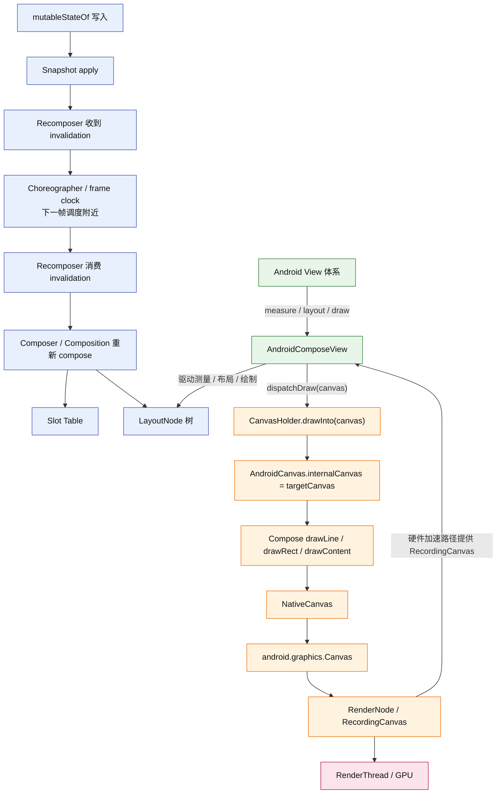

# 学习路线

> 本篇会结合关键源码入口理解流程，但不做完整源码逐行分析

1. 整体渲染管线
   - 理解组合 / 测量 / 布局 / 绘制分别做什么。
   - 理解状态变化可能影响不同阶段。
2. Compose UI 树和 LayoutNode
   - 理解 Composable 不等于 Android View
   - 结合 Compose 后的Android View树长什么样
   - 结合 `LayoutNode` 看 Compose 如何承接测量、布局、绘制。
3. 测量、布局与绘制原理
   - 先理解 `constraints -> measure -> place`。
   - 再结合 `MeasurePolicy`、`MeasureScope`、`Measurable`、`Placeable` 理解 measure / place。
   - 结合 `Canvas`、`drawBehind`、`drawWithContent` 理解绘制入口。
4. Modifier 与传统 View 的关系
   - 结合 `Modifier.Node` 理解 Modifier 如何参与不同阶段。
   - 结合 `AndroidComposeView` 理解 Compose 如何挂到 Android View 系统。

# 整体渲染管线

核心结论：

- Compose 从状态变化到屏幕更新，大体会经过组合、测量、布局、绘制。
- 组合决定有哪些 UI，测量决定多大，布局决定放哪，绘制决定长什么样。
- 状态变化不一定影响整条管线，有些变化影响组合，有些影响测量 / 布局，有些主要影响绘制。

## 组合 / 测量 / 布局 / 绘制

四个阶段的边界：

```text
组合：决定这次有哪些 UI。
测量：决定每个 UI 在约束下多大。
布局：决定已经量好的 UI 放在哪里。
绘制：决定在已确定的位置和大小里画什么。
```

例子：

```kotlin
@Composable
fun UserCard(showBadge: Boolean, name: String) {
    Column {
        Text(name)

        if (showBadge) {
            Text("VIP")
        }
    }
}
```

对应关系：

- `if (showBadge) { Text("VIP") }`：影响组合，UI 结构变了。
- `Modifier.size(100.dp)`：影响测量，节点大小变了。
- `Column` 把子项上下排列：属于布局，决定子项放哪。
- `Modifier.background(Color.Red)` / `Canvas { ... }` / `drawBehind { ... }`：参与绘制，在已有区域里画内容。

关键边界：

- 组合不关心尺寸和像素。
- 测量只决定大小，不决定最终坐标。
- 布局基于测量结果决定位置。
- 绘制不会重新决定占位，只在已有区域里画内容。

## 状态变化影响不同阶段

影响组合：

```kotlin
if (showBadge) {
    Text("VIP")
}
```

`showBadge` 改变后，UI 结构变了。


影响测量 / 布局：

```kotlin
Box(
    Modifier.size(if (expanded) 160.dp else 80.dp)
)
```

`expanded` 改变后，节点还在，但大小变了，可能影响父子布局。


影响绘制：

```kotlin
Box(
    Modifier.background(if (selected) Color.Red else Color.Gray)
)
```

`selected` 改变后，结构和大小可能都没变，只是颜色变了。


一句话：

```text
组合决定结构，测量决定大小，布局决定位置，绘制决定像素。
```

后续要继续回答：

```text
Composable 不是 View，那组合之后的 UI 结构到底交给谁去测量、布局、绘制
```

# Compose UI 树和 LayoutNode

核心结论：

- Composable 不是 Android View。
- Compose 会维护自己的 UI 树，真正参与测量、布局、绘制的核心节点是 `LayoutNode`。
- `LayoutNode` 是 Compose 源码里的真实类：`androidx.compose.ui.node.LayoutNode`。
- Compose 最终通过 `ComposeView` / `AndroidComposeView` 挂到 Android View 系统里。

## LayoutNode

`LayoutNode` 可以理解成：

```text
Compose UI 树里的布局 / 绘制节点
```

它主要承接：

- 子节点关系。
- Modifier 链。
- measure。
- layout。
- draw。
- semantics 等信息。

例如：

```kotlin
Column {
    Text("Ada")
    Text("VIP")
}
```

可以粗略理解成：

```text
LayoutNode(Column)
  LayoutNode(Text "Ada")
  LayoutNode(Text "VIP")
```

这只是心智模型，不是说每个 Composable 都一定对应一个 `LayoutNode`。

例如：

```kotlin
@Composable
fun UserName(name: String) {
    Text(name)
}
```

`UserName` 通常只是函数封装，不一定产生自己的 UI 节点。真正可能产生 UI 节点的是里面的 `Text(name)`。

关键点：

```text
Composable 调用很多
LayoutNode 只对应真正参与布局 / 绘制的 UI 节点
```

不要理解成：

```text
一个 Composable = 一个 LayoutNode
```

一句话：

```text
LayoutNode 是 Compose 自己的 UI 节点；Composable 用来声明 UI，LayoutNode 承接后续测量、布局、绘制。
```

## Android View 树入口

当前工程打印出来的 View 树：

```text
com.android.internal.policy.DecorView id=-1
  android.widget.LinearLayout id=-1
    android.view.ViewStub id=16908782
    android.widget.FrameLayout id=16908290
      androidx.compose.ui.platform.ComposeView id=-1
        androidx.compose.ui.platform.AndroidComposeView id=-1
          android.view.View id=-1
```

这棵 View 树说明：

- Activity 里不是每个 Composable 都变成了 Android View。

- 传统 View 树里主要看到的是 `ComposeView` 和它内部的 `AndroidComposeView`。

- `Column`、`Text`、`Button` 这些 Compose 内容主要存在于 Compose 内部的 `LayoutNode` 树里。

  

`ComposeView`：

- 暴露给 Android View 体系的 Compose 容器 View。
- 由 `Activity.setContent { ... }` 内部创建，并通过 `setContentView` 放进 `android.R.id.content`。
- 保存传入的 `@Composable content`。
- 管理 Composition 的创建和销毁策略。
- 对外表现为一个 Android `ViewGroup`。

设置时机：

```kotlin
// MainActivity.kt
setContent {
    ComposeLearnTheme {
        ...
    }
}

// ComponentActivity.setContent
public fun ComponentActivity.setContent(
    parent: CompositionContext? = null,
    content: @Composable () -> Unit
) {
  	...
    ComposeView(this).apply {
        // Set content and parent **before** setContentView
        // to have ComposeView create the composition on attach
        setParentCompositionContext(parent)
        setContent(content)
        // Set the view tree owners before setting the content view so that the inflation process
        // and attach listeners will see them already present
        setOwners()
        setContentView(this, DefaultActivityContentLayoutParams)
    }
}
```


`AndroidComposeView`：

- `ComposeView` 内部创建的 Compose Owner View。
- 承载 Compose 的 `LayoutNode` 树。
- 把 Android 的 measure / layout / draw / input / accessibility 等事件接到 Compose。

设置时机：

```kotlin
setContent {
    ComposeLearnTheme {
        Scaffold { ... }
    }
}
```

```text
1. Activity.onCreate 调用 setContent { ... }
2. activity-compose 创建 ComposeView
3. setContentView(ComposeView)，ComposeView 被放进 Activity 的 content FrameLayout
4. ComposeView attach 到 window 后，或者首次 measure 时创建 Composition
5. 创建 Composition 时，内部创建 AndroidComposeView
6. AndroidComposeView 持有 Compose 的 root LayoutNode
7. 后续 Compose 内容通过 LayoutNode 树测量、布局、绘制
```


可以粗略理解成：

```text
ComposeView：外层容器，给 Android View 树看的
AndroidComposeView：内部承载者，给 Compose UI 系统干活的
```

最后一层 `AndroidComposeView -> android.view.View` 通常是 Compose 内部为了某些 Android 平台能力挂的辅助 View，不代表你的 Composable 子节点变成了传统 View。

## LayoutNode 如何承接管线

Android View 系统只会看到 `AndroidComposeView`，不会直接看到 `Column`、`Text`、`Button`。

大体链路：

```text
Android View 系统
  -> AndroidComposeView
  -> root LayoutNode
  -> 子 LayoutNode 树
```

也可以理解成：

```text
Android View 管线负责把 measure / layout / draw 的机会给 AndroidComposeView。
Compose UI 管线负责让 LayoutNode 树完成真正的 UI 计算。
```

例如：

```kotlin
Column {
    Text("Hello")
    Button(onClick = {}) {
        Text("OK")
    }
}
```

从 Android View 树看，主要还是：

```text
ComposeView
  AndroidComposeView
```

从 Compose 内部看，可以粗略理解成：

```text
root LayoutNode
  LayoutNode(Column)
    LayoutNode(Text)
    LayoutNode(Button)
      LayoutNode(Text)
```

关键结论：

```text
Composable 声明 UI。
组合阶段生成 / 更新 LayoutNode 树。
LayoutNode 树承接后续测量、布局、绘制。
AndroidComposeView 把这棵树挂回 Android View 系统。
```

# 测量、布局与绘制原理

## constraints -> measure -> place

Compose 的布局过程：

```text
父节点给 constraints。
子节点在 constraints 内 measure，返回自己的 size。
父节点拿到子节点尺寸后，决定自己多大。
父节点在 layout 阶段把子节点 place 到具体位置。
```

`constraints` 是父节点给子节点的尺寸限制，主要包含：

```text
minWidth / maxWidth / minHeight / maxHeight
```

`measure` 用约束测量子节点，只得到大小：

```kotlin
val placeable = measurable.measure(constraints)
```

`place` 把已经测量好的子节点放到父节点坐标系里：

```kotlin
placeable.place(x = 0, y = 20)
```

例子：

```kotlin
Column {
    Text("A")
    Text("B")
}
```

可以粗略理解成：

```text
Column 收到父节点给自己的 constraints。
Column 测量 Text("A") 和 Text("B")。
Text("A") / Text("B") 返回自己的 size。
Column 根据子节点尺寸决定自己的 size。
Column 把 A 放到 y = 0，把 B 放到 y = A.height。
```

自定义 `Layout` 要先 measure 再 place，因为不先知道子节点多大，就无法决定父节点大小和子节点位置。通常会看到这种结构：

```kotlin
Layout(content = { ... }) { measurables, constraints ->
    val placeables = measurables.map { measurable ->
        measurable.measure(constraints)
    }

    layout(width, height) {
        placeables.forEach { placeable ->
            placeable.place(x, y)
        }
    }
}
```

关键边界：

```text
measure 决定大小，不决定最终位置。
place 决定位置，不重新测量。
```

## Layout 和 MeasurePolicy

`Layout` 不是普通 View 类，而是 Compose 提供的基础布局 Composable 函数。

它的核心作用：

```text
创建 / 更新 Compose UI 节点。
组合 content 里的子内容。
把 modifier 设置到节点上。
把 measurePolicy 设置到节点上。
```

简化源码：

```kotlin
@Composable
inline fun Layout(
    content: @Composable () -> Unit,
    modifier: Modifier = Modifier,
    measurePolicy: MeasurePolicy,
) {
    ReusableComposeNode<ComposeUiNode, Applier<Any>>(
        factory = ComposeUiNode.Constructor,
        update = {
            set(measurePolicy, SetMeasurePolicy)
            set(modifier, SetModifier)
        },
        content = content,
    )
}
```

几个概念的关系：

```text
Layout：写布局的入口。
LayoutNode：Compose 内部 UI 节点。
MeasurePolicy：挂到节点上的测量 / 布局规则。
MeasureScope：执行测量逻辑时的作用域。
Measurable：还没测量的子节点。
Placeable：已经测量完成、还没摆放的子节点。
```


`MeasurePolicy` 可以理解成一个 `LayoutNode` 的测量和布局规则。

它决定：

```text
子节点怎么测量。
当前节点自己多大。
子节点怎么摆放。
```

像 `Column`、`Row`、`Box` 都有自己的测量布局规则：

```text
Column：子节点竖着排。
Row：子节点横着排。
Box：子节点叠在一起。
```


`MeasureScope` 是执行测量逻辑时的作用域，可以理解成写测量布局逻辑时的工具箱。

它提供的能力包括：

```text
dp 转 px。
读取布局方向。
调用 layout(width, height) { ... }。
```


`Measurable` 是还没测量的子节点，关键能力是：

```kotlin
measurable.measure(constraints)
```


`Placeable` 是已经测量完成的子节点，已经有尺寸：

```kotlin
placeable.width
placeable.height
```

但它还没有最终位置，位置要在 `layout` block 里通过 `place` 决定：

```kotlin
layout(width, height) {
    placeable.place(x, y)
}
```


`MeasurePolicy` 的核心方法：

```kotlin
fun MeasureScope.measure(
    measurables: List<Measurable>,
    constraints: Constraints
): MeasureResult
```

`Measurable` 测量后会得到 `Placeable`：

```kotlin
fun measure(constraints: Constraints): Placeable
```

也就是：

```text
Measurable --measure(constraints)--> Placeable
```

`layout(width, height)` 用来声明当前节点自己的大小，并进入子节点摆放阶段。

### 结合 Column 源码理解

`Column` 源码可以简化成：

```kotlin
@Composable
inline fun Column(...) {
    val measurePolicy = columnMeasurePolicy(...)

    Layout(
        content = { ColumnScopeInstance.content() },
        measurePolicy = measurePolicy,
        modifier = modifier,
    )
}
```

这说明：

```text
Column 是 Composable。
Column 内部调用 Layout。
Layout 创建 / 更新 Compose UI 节点。
Column 把自己的 measurePolicy 交给 Layout。
measurePolicy 决定子节点竖着排。
```

`Column` 的测量布局逻辑大体是：

```text
逐个测量子节点，得到 Placeable。
主轴是高度，交叉轴是宽度。
Column 宽度取子节点中较宽的值。
Column 高度根据子节点高度累加。
最后在 layout block 里按 y 方向依次 place。
```

因为 `Column` 是竖着排，所以：

```text
主轴 main axis = 高度。
交叉轴 cross axis = 宽度。
```

源码里能看到类似关系：

```kotlin
// 测量 RowColumnMeasurePolicy.measure
val placeable = child.measure(childConstraints)

val placeableMainAxisSize = placeable.mainAxisSize()
val placeableCrossAxisSize = placeable.crossAxisSize()

// 布局 ColumnMeasurePolicy.placeHelper
layout(crossAxisLayoutSize, mainAxisLayoutSize) {
    placeables.forEachIndexed { i, placeable ->
        placeable.place(crossAxisPosition, mainAxisPositions[i])
    }
}
```

一句话：

```text
Layout 负责创建节点并挂上 MeasurePolicy；
MeasurePolicy 负责把 Measurable 测成 Placeable，再在 layout block 里 place 子节点。
```

## 绘制阶段

核心边界：

```text
布局阶段决定节点在哪里、多大。
绘制阶段决定在这个区域里画什么。
```

例如：

```kotlin
Box(
    Modifier
        .size(100.dp)
        .background(Color.Red)
)
```

对应关系：

```text
size(100.dp)：影响测量，决定 Box 多大。
background(Color.Red)：影响绘制，在已有区域里画红色。
```

常见绘制入口：

- `Canvas`：作为 Composable 参与测量 / 布局，然后在 draw block 里画自定义图形。
- `drawBehind`：在内容后面画，适合背景、底纹、装饰线。
- `drawWithContent`：可以控制自定义绘制和原内容的顺序，`drawContent()` 表示继续绘制原内容。

# Compose 和传统 View 的关系

## 软件绘制和硬件绘制

Compose UI 默认走宿主 View / Window 的硬件加速绘制环境。

关键点：

```text
Compose 不是单独发明一套 GPU 管线。
Compose 通过 AndroidComposeView 接入 Android View 绘制体系。
如果宿主 View / Window 关闭硬件加速，Compose 也可能走软件绘制路径。
正常 App 场景下，Compose 基本按硬件加速绘制理解。
```

## Canvas 桥接

Compose 的 `Canvas` 在 Android 上最终会桥接到 `android.graphics.Canvas`。

例如 Compose 里调用 `drawLine`，最终会走到 `AndroidCanvas.drawLine`：

```kotlin
Canvas(modifier = Modifier.fillMaxSize()) {
  drawLine(...)
}
```

```kotlin
@PublishedApi internal var internalCanvas: NativeCanvas = EmptyCanvas

override fun drawLine(p1: Offset, p2: Offset, paint: Paint) {
    internalCanvas.drawLine(p1.x, p1.y, p2.x, p2.y, paint.asFrameworkPaint())
}
```

`NativeCanvas` 是跨平台类型声明 `expect class NativeCanvas`。在 Android 平台：

```kotlin
// androidMain/androidx/compose/ui/graphics/AndroidCanvas.android.kt
actual typealias NativeCanvas = android.graphics.Canvas
```

也就是说，Compose 的绘制命令最终会转成对 `internalCanvas` 的调用。硬件加速路径下，`internalCanvas`的类型通常是 `RecordingCanvas`。


`NativeCanvas internalCanvas` 的注入：绘制入口先到 `AndroidComposeView.dispatchDraw`：

```kotlin
override fun dispatchDraw(canvas: android.graphics.Canvas) {
    canvasHolder.drawInto(canvas) {
        root.draw(
            canvas = this,
            graphicsLayer = null,
        )
    }
}
```

`internalCanvas` 随后在 `CanvasHolder.drawInto` 里被临时注入：

```kotlin
inline fun drawInto(targetCanvas: android.graphics.Canvas, block: Canvas.() -> Unit) {
    val previousCanvas = androidCanvas.internalCanvas
    androidCanvas.internalCanvas = targetCanvas
    androidCanvas.block()
    androidCanvas.internalCanvas = previousCanvas
}
```

整体链路：

```text
AndroidComposeView.dispatchDraw(canvas)
  -> canvasHolder.drawInto(canvas)
  -> AndroidCanvas.internalCanvas = targetCanvas
  -> root.draw(...)
  -> Compose Canvas.drawLine(...)
  -> internalCanvas.drawLine(...)
```

所以：

```text
不是 Compose 主动 new 出 RecordingCanvas。
Compose 只是把 Android View 体系传进来的 Canvas 包装进 AndroidCanvas。
```

## 整体关系

可以这样理解：

```text
Compose 自己维护 LayoutNode 树。
AndroidComposeView 接收传统 View 体系的 measure / layout / draw 回调。
这些回调进入 Compose UI 管线，驱动 LayoutNode 树测量、布局、绘制。
传统 View 体系下，AndroidComposeView 占据一块 View 空间。
Compose 最终通过 Android Canvas / RenderNode / GPU 管线显示到屏幕。
```

边界：

```text
Composable 不等于 Android View。
ComposeView / AndroidComposeView 是 Compose 接入传统 View 树的入口。
Column / Text / Button 等 Compose 内容主要存在于内部 LayoutNode 树里。
```

一句话：

```text
Compose 自己管理 UI 结构和布局绘制逻辑，但在 Android 上仍然借 AndroidComposeView 接入 View 树，并通过 Android 的绘制管线把结果显示出来。
```

## 组合与重组时机

组合 / 重组不是发生在 `AndroidComposeView.onMeasure()`、`onLayout()`、`dispatchDraw()` 里的固定步骤。

核心分工：

```text
Recomposer / Composer：负责组合和重组，生成或更新 LayoutNode 树。
AndroidComposeView：接收 View 的 measure / layout / draw 回调，消费 LayoutNode 树。
```

首次组合：

```text
Activity.setContent { ... }
  -> 创建 ComposeView
  -> ComposeView.setContent(content)
  -> 创建 Composition
  -> Composer 执行 content
  -> 生成 / 更新 LayoutNode 树
  -> AndroidComposeView 后续接收 measure / layout / draw
```

状态变化后的重组：

```text
mutableStateOf 写入新值
  -> Snapshot apply 发布变化
  -> Recomposer 收到 invalidation
  -> Composer 重组失效的 Composable
  -> 更新 Slot Table 和 LayoutNode 树
  -> 需要时触发测量 / 布局 / 绘制
```

所以重组发生在：

```text
Recomposer 消费 invalidation，并调用 Composition 重新 compose 的时候。
```

它通常发生在下一帧调度附近，和 Android 的 Choreographer / frame clock 有关系。

一句话：

```text
组合 / 重组决定和更新 UI 树；
测量 / 布局 / 绘制消费 UI 树，把结果显示出来。
```

## 整体流程图


