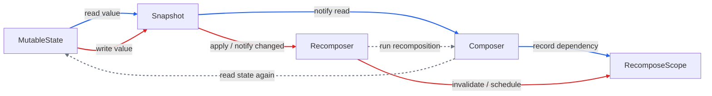

# 学习路线

1. Snapshot 系统解决什么问题
   - 理解 `mutableStateOf` 为什么不是普通变量。
   - 理解 Compose 怎么知道状态被谁读过，以及状态写入后为什么能通知相关组合失效。

2. Snapshot 的状态模型
   - 理解 StateObject / StateRecord 的基本关系。
   - 理解一个 state 对象为什么可能有多份记录，以及 Snapshot 为什么需要版本。

3. 读写追踪与 apply
   - 理解 Composable 读取 `state.value` 时如何建立依赖。
   - 理解修改 `state.value` 后如何进入 Snapshot 机制。
   - 理解 apply 后如何通知观察者，让相关组合失效。

4. Snapshot、Recomposer、Composer 的协作边界
   - 理解 Snapshot 负责发现 state 变化。
   - 理解 Recomposer 负责安排重组。
   - 理解 Composer 负责重新执行和对齐组合结构。
   - 区分 `remember`、`mutableStateOf`、Slot Table 和 Snapshot 的职责。
   - `remember` 不是状态追踪系统，它只是保存对象。
   - `mutableStateOf` 才是可观察状态。
   - 普通变量变化不会自动触发重组。

# Snapshot 系统解决什么问题

核心结论：

- Snapshot 系统解决的是 Compose state 的读写追踪和一致性问题。
- `mutableStateOf` 创建的是 Compose 可观察状态，不是普通变量。
- Snapshot 让 Compose 知道状态被谁读过，也让状态写入后能通知相关组合失效。

普通变量：

```kotlin
var count = 0
```

特点：

- 改了值，Compose 不知道，也不会自动触发重组。
- 没有读追踪和写通知。

Compose state：

```kotlin
var count by mutableStateOf(0)
```

特点：

- 读取时，Compose 可以知道"当前组合读取了这个 state"。
- 写入时，Compose 可以知道"这个 state 变了"，并把依赖它的组合标记为失效。
- Recomposer 后续会安排相关部分重组。

## 读写追踪

Snapshot 要解决的第一个问题：

```text
状态被谁读过
```

例子：

```kotlin
@Composable
fun CounterText(count: State<Int>) {
    Text("count = ${count.value}")
}
```

组合执行到：

```kotlin
count.value
```

Snapshot 系统可以配合当前组合上下文记录：

```text
这个组合读取了 count 这个 state
```

之后如果：

```kotlin
count.value = 1
```

Snapshot 就有机会知道：

```text
count 变了
之前读过 count 的组合可能需要重组
```

## Snapshot 是版本化读写环境

Snapshot 要解决的第二个问题：

```text
状态什么时候算真正写入成功
```

Compose 的状态读写不是简单裸改字段：

```text
在某个 Snapshot 里读
在某个 Snapshot 里写
写入 apply 后，再把变化通知出去
```

可以先粗略理解成：

```text
Snapshot 是 Compose state 的版本化读写环境
```

它的作用：

- 让状态读写可以被追踪。
- 让写入可以合并并通知观察者。
- 让并发或嵌套状态修改有一致性规则。
- 让 Recomposer 知道哪些组合需要重新执行。

## remember 和 mutableStateOf 的分工

```kotlin
var count by remember { mutableStateOf(0) }
```

分工：

```text
remember：把 mutableStateOf(0) 这个 state 对象在重组间保存下来
mutableStateOf：创建可观察状态，让读写能进入 Snapshot 系统
```

所以不是 `remember` 让状态可观察，而是 `mutableStateOf` 本身可观察。

闭环：

```text
Composable 读取 state.value
-> Snapshot / Compose 记录这个读取关系
-> state.value 被修改
-> Snapshot apply 后通知变化
-> 相关组合失效
-> Recomposer 安排重组
```

一句话：

```text
Snapshot 系统让 Compose state 从"普通内存值"变成"可追踪、可通知、可按版本管理的状态"。
```

# Snapshot 的状态模型

核心结论：

- `mutableStateOf` 创建的是一个可被 Snapshot 管理的状态对象。
- StateObject 表示状态身份，StateRecord 表示这个状态在某个 Snapshot 下的值。
- 状态值不是靠一个普通字段直接裸存，而是通过 StateRecord 这类版本记录参与 Snapshot 读写。

可以先粗略理解成：

```text
state 这个对象 = StateObject
state 里面保存的某个版本的值 = StateRecord
```

也就是：

```kotlin
val state = mutableStateOf(0)
```

不是简单等于：

```kotlin
class Box {
    var value = 0
}
```

更接近这个心智模型：

```text
MutableState
  -> StateRecord(value = 0, snapshotId = ...)
  -> StateRecord(value = 1, snapshotId = ...)
  -> StateRecord(value = 2, snapshotId = ...)
```

这不是源码逐字结构，只是帮助理解。


为什么需要 StateRecord：

- Snapshot 系统要支持不同 Snapshot 看到不同版本的 state 值。
- 如果只是一个普通字段，很难表达谁看到旧值、谁写了新值、什么时候正式生效、冲突怎么判断。
- StateRecord 让状态值可以按版本参与读写隔离、变更通知和冲突检测。

关系：

```text
StateObject：这个状态对象是谁
StateRecord：这个状态对象在某个 Snapshot 里的值是什么
Snapshot：当前读写应该看哪一份 StateRecord
```

读取：

```kotlin
state.value
```

Snapshot 系统会：

```text
找到当前 Snapshot 下可见的 StateRecord
从这个 StateRecord 里读出 value
```

写入：

```kotlin
state.value = 1
```

Snapshot 系统会：

```text
找到或创建当前 Snapshot 可写的 StateRecord
把新值写到这份记录里
等 Snapshot apply 时，再把变化发布出去
```

闭环：

```text
mutableStateOf
-> 创建 Snapshot 可管理的 StateObject
-> 具体值存在 StateRecord
-> 读取时按当前 Snapshot 找可见记录
-> 写入时写到当前 Snapshot 的记录
-> apply 后变化才发布出去
```

一句话：

```text
Snapshot 的状态模型，就是用 StateObject 表示状态身份，用 StateRecord 表示状态在不同 Snapshot 下的值。
```

# 读写追踪与 apply

核心结论：

- 读 state 会建立依赖：当前 RecomposeScope 依赖这个 state。
- 写 state 会记录变化：这个 state 被修改了。
- apply 会发布变化：通知观察者，让相关 RecomposeScope 失效。
- Snapshot 管 state 的读写和通知，Recomposer 管调度，Composer 管重组执行。

完整链路：

```text
读取 state.value
-> Snapshot 记录这次 read
-> 当前 RecomposeScope 知道自己依赖了这个 state

写入 state.value
-> Snapshot 记录这次 write
-> apply 后通知观察者
-> 依赖这个 state 的 RecomposeScope 被标记为 invalid
-> Recomposer 安排重组
```

## 读追踪

例子：

```kotlin
@Composable
fun CounterText(count: State<Int>) {
    Text("count = ${count.value}")
}
```

当组合执行到：

```kotlin
count.value
```

这里不是普通字段读取。Snapshot 系统会知道这个 state 被读取了，同时 Compose 当前正在组合某个作用域，所以可以建立关系：

```text
当前 RecomposeScope 依赖 count 这个 state
```

也就是：

```text
state count
  -> 被 CounterText 这个组合范围读取过
```

## 写追踪与 apply

当写入：

```kotlin
count.value = 1
```

Snapshot 会记录：

```text
这个 state 被写入了
```

写入不只是"值变了"，它还需要经历 apply：

```text
写入：在当前 Snapshot 里记录修改
apply：把修改提交出去，并通知观察者
```

apply 大概负责：

```text
确认这批写入
合并到全局可见状态
通知观察者：哪些 state 变了
```

Compose Runtime 收到变化后，会找到之前读取过这些 state 的组合范围，把它们标记为失效。

失效不是马上重新画 UI，而是：

```text
这个 RecomposeScope 需要在下一轮重组中重新执行
```

## 读写流程图



图里三条路线：

```text
蓝色：读取 state，建立 state -> RecomposeScope 依赖
红色：写入 state，通知变化并让相关 scope 失效
灰色虚线：Recomposer 调度 Composer 重新执行
```

关键类：

- `MutableState`：保存可观察状态值，读写 `value` 会进入 Snapshot 机制。

- `Snapshot`：管理 state 的读写版本，记录 read / write，并在 apply 时发布变化。

- `Composer`：执行组合，知道当前正在组合哪个 `RecomposeScope`，并把 state read 记录到当前 scope 上。

- `RecomposeScope`：可失效的重组范围；它读过的 state 变化后，会被标记为 invalid。

- `Recomposer`：接收失效信号，决定什么时候重新执行相关组合。

  

write 和 apply 关系：

- write 把修改记录到当前 Snapshot，apply 提交这批修改，并对外发布哪些 state 变了。
- 在一个 mutable snapshot 里，可以先发生多次 write，再统一 apply：

```text
write A
write B
write C
apply
```


apply 和 Recomposer 关系：

- apply 负责发布 state 变化，Recomposer 收到变化后把相关 RecomposeScope 标记为 invalid。
- 真正重组通常在后续 frame / 调度点统一执行；多次 apply 可能只对应后面一轮重组。

```text
apply A
apply B
apply C
-> Recomposer 下一轮重组
```

+ Snapshot apply 是"发布变化"，Recomposer 重组是"消费变化"


完整链路：

```
state.value 被读取
-> Snapshot / Composer 记录这个读取依赖

state.value 被写入
-> Snapshot 记录写入
-> apply 后发布变化
-> Recomposer 收到变化
-> 对应 RecomposeScope invalid

下一轮重组
-> Recomposer 调度
-> Composer 重新执行相关 Composable
-> Composer 和 Slot Table 对齐旧结构
-> remember 从 slot 里取回旧值
```

## 最小例子

```kotlin
var count by remember { mutableStateOf(0) }

Text("count = $count")

Button(onClick = { count++ }) {
    Text("+1")
}
```

第一次组合：

```text
执行 Text("count = $count")
-> 读取 count
-> 当前组合范围记录依赖 count
```

点击按钮：

```text
count++
-> 写入 count state
-> Snapshot apply
-> 通知 count 变了
-> 读取过 count 的组合范围失效
-> Recomposer 安排重组
-> Text 重新读取 count，显示新值
```

边界：

```text
Snapshot：发现 state 的读写变化，通知哪些 state 变了
Recomposer：安排什么时候重组
Composer：重新执行相关 Composable，并和旧结构对齐
```

一句话：

```text
读 state 建立依赖，写 state 记录变化，apply 发布变化，相关组合失效，Recomposer 安排重组。
```
